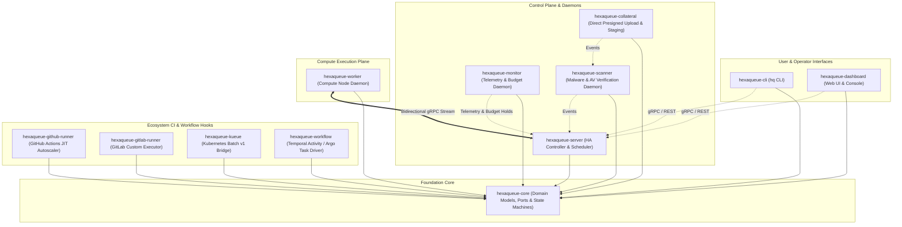

# ⚡ Hexaqueue

> **Cloud-Agnostic HPC Batch Scheduler and Distributed Job Orchestrator**

Built 100% on top of **Hexastack** (Hexagonal Architecture & CQRS for Python).

---

## 🧭 Monorepo Package Architecture

---

## 📦 Hexastack Dependency Map

```mermaid
graph TD
    subgraph S1["Hexaqueue Packages"]
        HQ_CORE["hexaqueue-core"]
        HQ_CLI["hexaqueue-cli"]
        HQ_SERVER["hexaqueue-server"]
        HQ_WORKER["hexaqueue-worker"]
        HQ_COLLATERAL["hexaqueue-collateral"]
        HQ_SCANNER["hexaqueue-scanner"]
        HQ_MONITOR["hexaqueue-monitor"]
        HQ_DASHBOARD["hexaqueue-dashboard"]
    end

    subgraph S2["Hexastack Foundation"]
        HS_AUTH["hexastack-auth (SPIFFE/mTLS & OIDC)"]
        HS_CLI["hexastack-cli (Typer & Rich Output)"]
        HS_CORE["hexastack-core (DI Container & Ports)"]
        HS_CQRS["hexastack-cqrs (Commands, Queries, Events)"]
        HS_DB["hexastack-db (PostgreSQL / SQLite Persistence)"]
        HS_EVENTS["hexastack-events (NATS JetStream & Redis)"]
        HS_FASTAPI["hexastack-fastapi (REST, Rate Limits & UI)"]
        HS_GRPC["hexastack-grpc (Protobuf Streaming & Reflection)"]
        HS_LOG["hexastack-logging (Structured JSON Logs)"]
        HS_OTEL["hexastack-otel (OpenTelemetry & Prometheus)"]
    end

    HQ_CORE --> HS_CORE
    HQ_CORE --> HS_CQRS

    HQ_CLI --> HS_CLI
    HQ_CLI --> HS_CORE
    HQ_CLI --> HS_CQRS
    HQ_CLI --> HS_GRPC

    HQ_SERVER --> HS_AUTH
    HQ_SERVER --> HS_CORE
    HQ_SERVER --> HS_CQRS
    HQ_SERVER --> HS_DB
    HQ_SERVER --> HS_EVENTS
    HQ_SERVER --> HS_FASTAPI
    HQ_SERVER --> HS_GRPC
    HQ_SERVER --> HS_OTEL

    HQ_WORKER --> HS_AUTH
    HQ_WORKER --> HS_CORE
    HQ_WORKER --> HS_GRPC
    HQ_WORKER --> HS_LOG

    HQ_COLLATERAL --> HS_AUTH
    HQ_COLLATERAL --> HS_CORE
    HQ_COLLATERAL --> HS_EVENTS
    HQ_COLLATERAL --> HS_FASTAPI

    HQ_SCANNER --> HS_AUTH
    HQ_SCANNER --> HS_CORE
    HQ_SCANNER --> HS_EVENTS
    HQ_SCANNER --> HS_LOG

    HQ_MONITOR --> HS_CORE
    HQ_MONITOR --> HS_EVENTS
    HQ_MONITOR --> HS_OTEL

    HQ_DASHBOARD --> HS_AUTH
    HQ_DASHBOARD --> HS_FASTAPI
    HQ_DASHBOARD --> HS_GRPC
```

---

## 📚 Package Directory Index

| Package | Version | Description |
|---|---|---|
| [`hexaqueue`](file:///home/rjdw/Projects/hexaqueue/packages/hexaqueue/README.md) | `0.0.0` | Umbrella metapackage (`pip install hexaqueue[all]`) |
| [`hexaqueue-core`](file:///home/rjdw/Projects/hexaqueue/packages/hexaqueue_core/README.md) | `0.0.0` | Pure domain models, lifecycle state machines, port interfaces |
| [`hexaqueue-cli`](file:///home/rjdw/Projects/hexaqueue/packages/hexaqueue_cli/README.md) | `0.0.0` | `hq` interactive terminal CLI |
| [`hexaqueue-server`](file:///home/rjdw/Projects/hexaqueue/packages/hexaqueue_server/README.md) | `0.0.0` | HA central controller & scheduler engine |
| [`hexaqueue-worker`](file:///home/rjdw/Projects/hexaqueue/packages/hexaqueue_worker/README.md) | `0.0.0` | Compute node execution daemon (cgroups v2, GPU isolation) |
| [`hexaqueue-collateral`](file:///home/rjdw/Projects/hexaqueue/packages/hexaqueue_collateral/README.md) | `0.0.0` | Direct presigned multi-part upload & staging storage service |
| [`hexaqueue-scanner`](file:///home/rjdw/Projects/hexaqueue/packages/hexaqueue_scanner/README.md) | `0.0.0` | Malware scanning, AV (ClamAV/YARA) & quarantine daemon |
| [`hexaqueue-monitor`](file:///home/rjdw/Projects/hexaqueue/packages/hexaqueue_monitor/README.md) | `0.0.0` | Health, heartbeat telemetry & budget tracking daemon |
| [`hexaqueue-dashboard`](file:///home/rjdw/Projects/hexaqueue/packages/hexaqueue_dashboard/README.md) | `0.0.0` | Web interface, cluster visualizer & operator console |
| [`hexaqueue-github-runner`](file:///home/rjdw/Projects/hexaqueue/packages/hexaqueue_github_runner/README.md) | `0.0.0` | GitHub Actions JIT autoscaler & webhook bridge |
| [`hexaqueue-gitlab-runner`](file:///home/rjdw/Projects/hexaqueue/packages/hexaqueue_gitlab_runner/README.md) | `0.0.0` | GitLab CI/CD Custom Executor driver |
| [`hexaqueue-kueue`](file:///home/rjdw/Projects/hexaqueue/packages/hexaqueue_kueue/README.md) | `0.0.0` | Kubernetes Batch v1 & Kueue controller bridge |
| [`hexaqueue-workflow`](file:///home/rjdw/Projects/hexaqueue/packages/hexaqueue_workflow/README.md) | `0.0.0` | Temporal Activity worker & Argo workflow driver |
