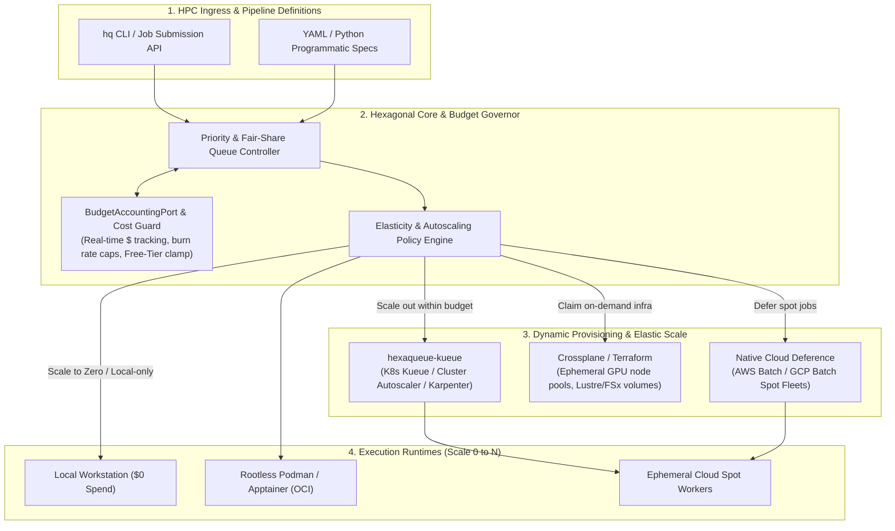

# Architecture & Ecosystem Integration

> Hexaqueue decouples core scheduling logic, graph dependency evaluation, storage isolation, and compute runtimes across strict hexagonal layers while modernizing traditional HPC batch systems (LSF, SGE, Univa) with cloud-native elasticity and dynamic budget governance.

---

## 1. The Hexagonal Golden Rules

1. **Pure Domain Center (`domain/`)**:
   - Zero framework or infrastructure dependencies.
   - Contains pure models (`JobSpec`, `RunSpec`, `ResourceRequirements`), DAG graph validation (`JobDagEngine`), parameter matrix compilers (`GroupExpansionEngine`), and lifecycle state machines (`compute_run_state`, `compute_run_outcome`).
   - All domain exceptions subclass `HexaqueueError`.

2. **Ports as Inversion Boundaries (`ports/`)**:
   - `JobQueuePort`: Abstract task enqueueing, dequeueing, and priority indexing.
   - `SchedulerControllerPort`: Central pipeline submission and status aggregation.
   - `StorageVolumePort`: Isolated scratch storage allocation and ephemeral cleanup.
   - `ExecutionRuntimePort`: Subprocess and containerized process execution.
   - `BudgetAccountingPort`: Real-time dollar-denominated budget tracking, burn rate caps, and spot instance arbitration.
   - `LogStreamPort`: Chunked stdout/stderr real-time streaming.

3. **Adapters Implement Ports (`adapters/`)**:
   - Translate external protocols (POSIX subprocesses, local memory queues, disk storage, S3/GCS, Kubernetes Kueue, Temporal/Argo) into internal domain contracts.
   - Adapters never import from `infra/`.

4. **Zero-Cost Guard & Native Deference**:
   - Provides software-managed local adapters and provider-native deference adapters (AWS Batch, GCP Batch).
   - Supports `FREE_TIER` resource clamping for $0 cloud spend developer loops.

---

## 2. Modernizing Traditional HPC (LSF, SGE, Univa) with Cloud Elasticity

Traditional HPC batch schedulers (IBM Spectrum LSF, Sun/Oracle Grid Engine SGE, Univa/Altair Grid Engine, and Slurm) were architected for static, on-premise clusters with fixed node counts and shared NFS mounts.

Hexaqueue retains drop-in user familiarity (declarative DAGs, job dependencies like `AFTER_OK`, resource requests, arrays) while solving legacy pain points through **scale-to-zero elasticity**, **dollar-denominated budget enforcement**, and **hermetic container isolation**:

### Key Elastic Capabilities:
* **Scale-from-Zero to N (and Scale-to-Zero)**:
  Instead of burning budget on idle compute nodes, `hexaqueue-kueue` interacts with Kubernetes cluster autoscalers, Karpenter, and cloud batch fleets. Worker nodes spin up on demand and terminate immediately when queues drain.
* **Dollar-Denominated Budget Guards (`BudgetAccountingPort`)**:
  Project tenants and individual pipeline runs can enforce strict dollar limits (e.g., `$50/run` or `$500/day`). When budgets tighten, the scheduler automatically shifts workloads to Spot/Preemptible instances or local runtimes.
* **Hermetic Collateral vs. Fragile NFS**:
  Replaces fragile global shared filesystems with content-addressable collateral (`hexaqueue-collateral`) and rootless container isolation (`hexaqueue-worker`).

---

## 3. Infrastructure & Packaging Ecosystem

Hexaqueue clearly separates container packaging, static infrastructure bootstrap, and dynamic cloud claims across three key tools:

| Ecosystem Tool | Hexaqueue Layer | Primary Responsibility |
|---|---|---|
| **Docker / Dockerfile** | `hexaqueue-worker` | Packaging reproducible OCI container images (Apptainer / Podman / Docker) with hermetic read-only collateral volume mounts. |
| **Terraform / OpenTofu** | Infrastructure Bootstrap | Declarative, static provisioning of baseline VPCs, Kubernetes clusters (EKS/GKE/AKS), cloud object stores (S3/GCS), and IAM roles. |
| **Crossplane** | `hexaqueue-kueue` & Cloud Claims | Kubernetes-native control plane managing dynamic, on-demand infrastructure claims (e.g., ephemeral Lustre/FSx storage volumes or dedicated GPU node pools). |
