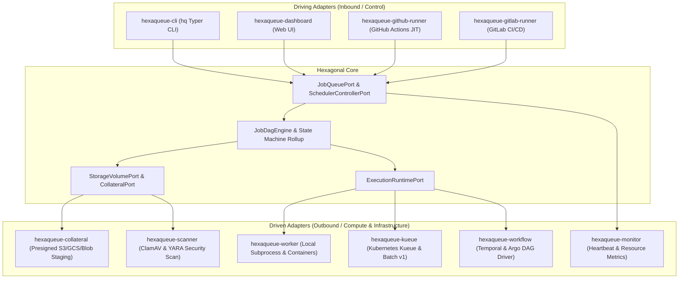

# Hexaqueue

> **Cloud-Agnostic HPC Batch Scheduler and Distributed Job Orchestrator for Python 3.13+.**

[](https://www.python.org/downloads/)
[](architecture.md)
[](https://github.com/TheTrueSCU/hexastack)

---

## 🌟 Why Hexaqueue?

Modern HPC batch scheduling and distributed ML pipeline orchestration require high performance, zero cross-job contamination, multi-cloud flexibility, and a seamless developer loop. Built on [**Hexastack**](https://github.com/TheTrueSCU/hexastack) (Hexagonal Architecture & CQRS for Python), **Hexaqueue** solves this by establishing strict hexagonal architectural boundaries, native cloud-deference, and a $0 cloud spend developer experience:



---

## 🚀 Quickstart: Local Developer Loop

Execute multi-stage DAG compute pipelines locally with zero cloud configuration:

```bash
# 1. Submit and watch a pipeline
uv run hq run submit examples/data-pipeline/pipelines/etl_workflow.yaml --watch

# 2. Check execution status
uv run hq status demo-etl-run

# 3. Inspect task execution logs
uv run hq logs stage1-extract
```
