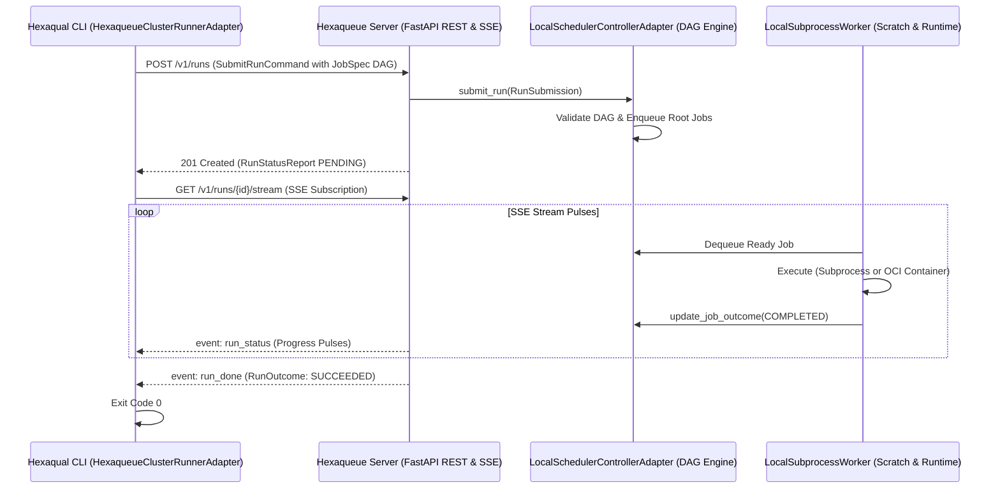

# hexaqual-cluster

> Running Hexaqual Test and Mutation Suites on a Local Hexaqueue Cluster

Built with **[Hexaqueue](https://github.com/TheTrueSCU/hexaqueue)** — The Cloud-Agnostic HPC Batch Scheduler and Distributed Job Orchestrator, and **[Hexaqual](https://github.com/TheTrueSCU/hexaqual)** — Universal Quality Governance Toolchain.

---

## Overview

This example demonstrates how **Hexaqual** uses its `HexaqueueClusterRunnerAdapter` to distribute test suites and mutation testing jobs (`pytest-gremlins`) across a **Hexaqueue cluster** over REST (`POST /v1/runs`) and real-time Server-Sent Events (SSE) telemetry (`GET /v1/runs/{id}/stream`).

It supports two execution modes:
1. **v0.1.0 Local Subprocess Cluster**: Runs compute tasks directly on the host using POSIX subprocesses inside isolated scratch directories with zero external dependencies.
2. **Local Container Cluster**: Executes compute tasks inside rootless OCI containers (via Podman/Docker) using `PodmanExecutionRuntimeAdapter`.

---

## Execution Flow



---

## Running the Example

### Prerequisites
Requires `hexaqual[all] >= 0.9.0` (with `HexaqueueClusterRunnerAdapter` support).

### 1. Run on v0.1.0 Local Subprocess Cluster
```bash
uv run python examples/hexaqual-cluster/run_hexaqual_cluster.py
```

### 2. Run on Local Container Cluster (Rootless Podman/Docker)
```bash
uv run python examples/hexaqual-cluster/run_hexaqual_cluster.py --container
```

### 3. Custom Target Package
```bash
uv run python examples/hexaqual-cluster/run_hexaqual_cluster.py --package packages/hexaqueue_scanner
```

---

## Architecture Invariants & Zero Circularity

- **Pure HTTP/SSE Wire Boundary**: `HexaqualClusterRunnerAdapter` communicates strictly over HTTP REST and SSE streams using `httpx`.
- **Zero Package Coupling**: `hexaqual` contains zero runtime dependencies on `hexaqueue` packages. `hexaqueue` consumes `hexaqual` solely as a developer quality tool (`[dependency-groups] dev`).
