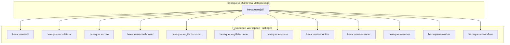

# ⚡ `hexaqueue` (Umbrella Metapackage)

> Unified distribution providing turnkey installation and multi-component orchestration for Hexaqueue.

---

## 🏗️ Architecture & Dependencies

```mermaid
graph TD
    subgraph S1["hexaqueue (Umbrella Metapackage)"]
        META["hexaqueue[all]"]
    end

    subgraph S2["Hexaqueue Workspace Packages"]
        HQ_CLI["hexaqueue-cli"]
        HQ_COLLATERAL["hexaqueue-collateral"]
        HQ_CORE["hexaqueue-core"]
        HQ_DASHBOARD["hexaqueue-dashboard"]
        HQ_GITHUB["hexaqueue-github-runner"]
        HQ_GITLAB["hexaqueue-gitlab-runner"]
        HQ_KUEUE["hexaqueue-kueue"]
        HQ_MONITOR["hexaqueue-monitor"]
        HQ_SCANNER["hexaqueue-scanner"]
        HQ_SERVER["hexaqueue-server"]
        HQ_WORKER["hexaqueue-worker"]
        HQ_WORKFLOW["hexaqueue-workflow"]
    end

    META --> HQ_CLI
    META --> HQ_COLLATERAL
    META --> HQ_CORE
    META --> HQ_DASHBOARD
    META --> HQ_GITHUB
    META --> HQ_GITLAB
    META --> HQ_KUEUE
    META --> HQ_MONITOR
    META --> HQ_SCANNER
    META --> HQ_SERVER
    META --> HQ_WORKER
    META --> HQ_WORKFLOW
```
