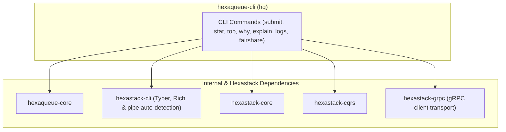

# 💻 `hexaqueue-cli`

> Modern interactive developer and operator terminal CLI (`hq`).

---

## 🏗️ Architecture & Dependencies

```mermaid
graph TD
    subgraph S1["hexaqueue-cli (hq)"]
        COMMANDS["CLI Commands (submit, stat, top, why, explain, logs, fairshare)"]
    end

    subgraph S2["Internal & Hexastack Dependencies"]
        HQ_CORE["hexaqueue-core"]
        HS_CLI["hexastack-cli (Typer, Rich & pipe auto-detection)"]
        HS_CORE["hexastack-core"]
        HS_CQRS["hexastack-cqrs"]
        HS_GRPC["hexastack-grpc (gRPC client transport)"]
    end

    COMMANDS --> HQ_CORE
    COMMANDS --> HS_CLI
    COMMANDS --> HS_CORE
    COMMANDS --> HS_CQRS
    COMMANDS --> HS_GRPC
```
