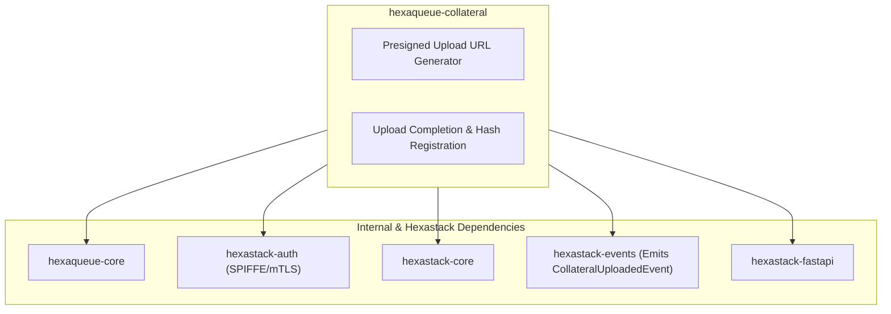

# 📦 `hexaqueue-collateral`

> Ingestion service for direct presigned multi-part uploads and staging storage management.

---

## 🏗️ Architecture & Dependencies

```mermaid
graph TD
    subgraph S1["hexaqueue-collateral"]
        URL_GEN["Presigned Upload URL Generator"]
        NOTIFY["Upload Completion & Hash Registration"]
    end

    subgraph S2["Internal & Hexastack Dependencies"]
        HQ_CORE["hexaqueue-core"]
        HS_AUTH["hexastack-auth (SPIFFE/mTLS)"]
        HS_CORE["hexastack-core"]
        HS_EVENTS["hexastack-events (Emits CollateralUploadedEvent)"]
        HS_FASTAPI["hexastack-fastapi"]
    end

    S1 --> HQ_CORE
    S1 --> HS_AUTH
    S1 --> HS_CORE
    S1 --> HS_EVENTS
    S1 --> HS_FASTAPI
```
