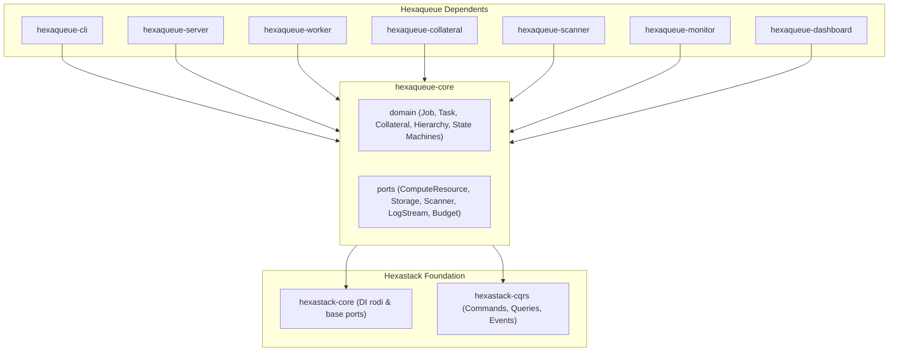

# 🧩 `hexaqueue-core`

> Pure domain models, lifecycle state machines, scheduling algorithms, and hexagonal port interfaces for Hexaqueue.

---

## 🏗️ Architecture & Dependencies

---

## 🔑 Key Responsibilities
- **Domain Entities**: `JobSpec`, `TaskSpec`, `RunSpec`, `CollateralBundle`, `ResourceRequirements`.
- **Lifecycle State Machines**: `JobState` (`SUBMITTED`, `BLOCKED`, `PENDING`, `PROVISIONING`, `RUNNING`, `CLEANUP`, `DONE`) and aggregated `RunState` roll-up.
- **Hexagonal Ports**: `ComputeResourcePort`, `StorageVolumePort`, `ExecutionRuntimePort`, `BudgetAccountingPort`, `CostRateModelPort`, `BastionAccessPort`.
