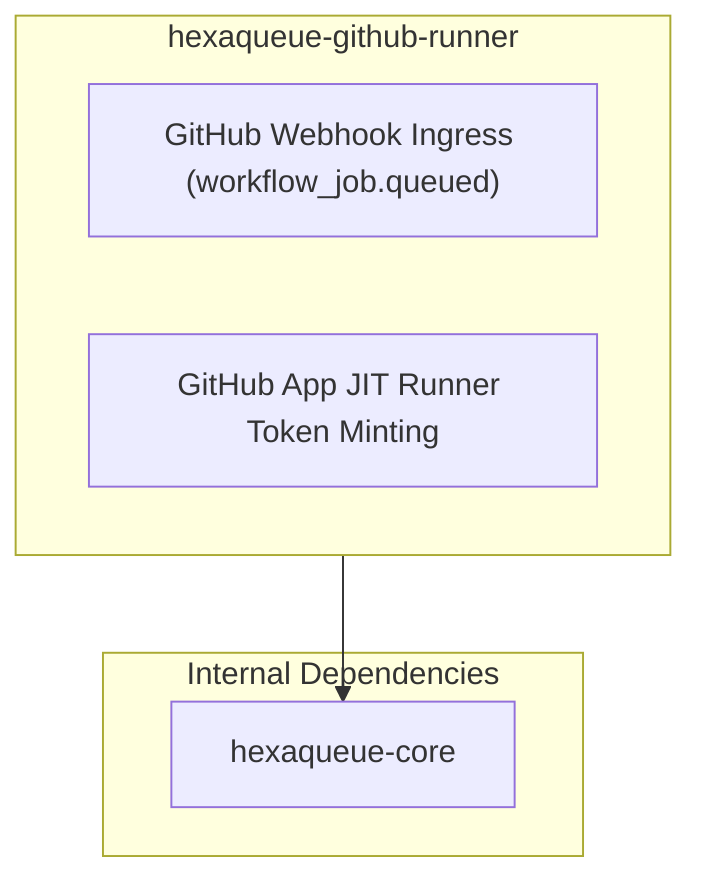

# 🐙 `hexaqueue-github-runner`

> GitHub Actions Dynamic Self-Hosted Runner Autoscaler & Webhook Bridge.

---

## 🏗️ Architecture & Dependencies

```mermaid
graph TD
    subgraph S1["hexaqueue-github-runner"]
        WEBHOOK["GitHub Webhook Ingress (workflow_job.queued)"]
        JIT["GitHub App JIT Runner Token Minting"]
    end

    subgraph S2["Internal Dependencies"]
        HQ_CORE["hexaqueue-core"]
    end

    S1 --> HQ_CORE
```
