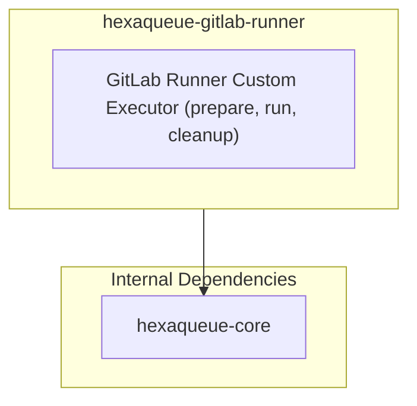

# 🦊 `hexaqueue-gitlab-runner`

> GitLab CI/CD Custom Executor Driver.

---

## 🏗️ Architecture & Dependencies

```mermaid
graph TD
    subgraph S1["hexaqueue-gitlab-runner"]
        EXECUTOR["GitLab Runner Custom Executor (prepare, run, cleanup)"]
    end

    subgraph S2["Internal Dependencies"]
        HQ_CORE["hexaqueue-core"]
    end

    S1 --> HQ_CORE
```
