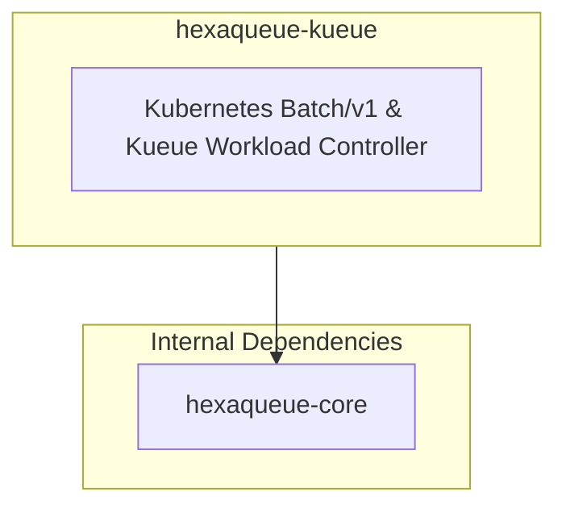

# ☸️ `hexaqueue-kueue`

> Kubernetes Batch v1 & Kueue Scheduler Controller Bridge.

---

## 🏗️ Architecture & Dependencies

```mermaid
graph TD
    subgraph S1["hexaqueue-kueue"]
        CONTROLLER["Kubernetes Batch/v1 & Kueue Workload Controller"]
    end

    subgraph S2["Internal Dependencies"]
        HQ_CORE["hexaqueue-core"]
    end

    S1 --> HQ_CORE
```
