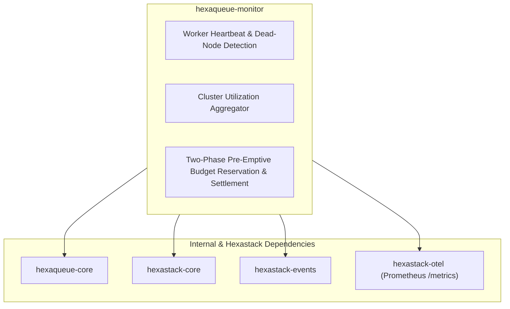

# 📈 `hexaqueue-monitor`

> Cluster health, worker/server heartbeat pulse monitoring, and two-phase budget accounting daemon.

---

## 🏗️ Architecture & Dependencies

```mermaid
graph TD
    subgraph S1["hexaqueue-monitor"]
        HEALTH["Worker Heartbeat & Dead-Node Detection"]
        TELEMETRY["Cluster Utilization Aggregator"]
        BUDGET["Two-Phase Pre-Emptive Budget Reservation & Settlement"]
    end

    subgraph S2["Internal & Hexastack Dependencies"]
        HQ_CORE["hexaqueue-core"]
        HS_CORE["hexastack-core"]
        HS_EVENTS["hexastack-events"]
        HS_OTEL["hexastack-otel (Prometheus /metrics)"]
    end

    S1 --> HQ_CORE
    S1 --> HS_CORE
    S1 --> HS_EVENTS
    S1 --> HS_OTEL
```
