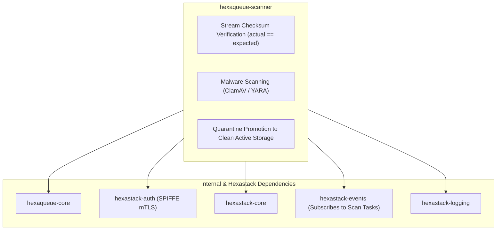

# 🛡️ `hexaqueue-scanner`

> Security worker daemon executing hash verification, ClamAV/YARA scans, and artifact quarantine.

---

## 🏗️ Architecture & Dependencies

```mermaid
graph TD
    subgraph S1["hexaqueue-scanner"]
        HASH["Stream Checksum Verification (actual == expected)"]
        AV["Malware Scanning (ClamAV / YARA)"]
        PROMOTION["Quarantine Promotion to Clean Active Storage"]
    end

    subgraph S2["Internal & Hexastack Dependencies"]
        HQ_CORE["hexaqueue-core"]
        HS_AUTH["hexastack-auth (SPIFFE mTLS)"]
        HS_CORE["hexastack-core"]
        HS_EVENTS["hexastack-events (Subscribes to Scan Tasks)"]
        HS_LOG["hexastack-logging"]
    end

    S1 --> HQ_CORE
    S1 --> HS_AUTH
    S1 --> HS_CORE
    S1 --> HS_EVENTS
    S1 --> HS_LOG
```
