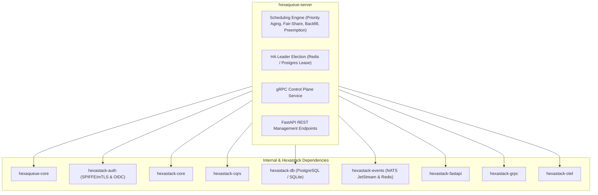

# 🏛️ `hexaqueue-server`

> High-Availability Central Controller and Batch Scheduling Daemon.

---

## 🏗️ Architecture & Dependencies

```mermaid
graph TD
    subgraph S1["hexaqueue-server"]
        SCHED["Scheduling Engine (Priority Aging, Fair-Share, Backfill, Preemption)"]
        HA["HA Leader Election (Redis / Postgres Lease)"]
        GRPC_API["gRPC Control Plane Service"]
        REST_API["FastAPI REST Management Endpoints"]
    end

    subgraph S2["Internal & Hexastack Dependencies"]
        HQ_CORE["hexaqueue-core"]
        HS_AUTH["hexastack-auth (SPIFFE/mTLS & OIDC)"]
        HS_CORE["hexastack-core"]
        HS_CQRS["hexastack-cqrs"]
        HS_DB["hexastack-db (PostgreSQL / SQLite)"]
        HS_EVENTS["hexastack-events (NATS JetStream & Redis)"]
        HS_FASTAPI["hexastack-fastapi"]
        HS_GRPC["hexastack-grpc"]
        HS_OTEL["hexastack-otel"]
    end

    S1 --> HQ_CORE
    S1 --> HS_AUTH
    S1 --> HS_CORE
    S1 --> HS_CQRS
    S1 --> HS_DB
    S1 --> HS_EVENTS
    S1 --> HS_FASTAPI
    S1 --> HS_GRPC
    S1 --> HS_OTEL
```
