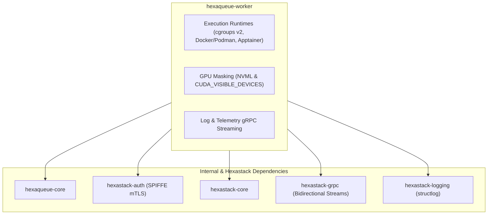

# 🐝 `hexaqueue-worker`

> Lightweight compute node execution daemon with GPU isolation and real-time streaming.

---

## 🏗️ Architecture & Dependencies

```mermaid
graph TD
    subgraph S1["hexaqueue-worker"]
        RUNNER["Execution Runtimes (cgroups v2, Docker/Podman, Apptainer)"]
        GPU["GPU Masking (NVML & CUDA_VISIBLE_DEVICES)"]
        STREAM["Log & Telemetry gRPC Streaming"]
    end

    subgraph S2["Internal & Hexastack Dependencies"]
        HQ_CORE["hexaqueue-core"]
        HS_AUTH["hexastack-auth (SPIFFE mTLS)"]
        HS_CORE["hexastack-core"]
        HS_GRPC["hexastack-grpc (Bidirectional Streams)"]
        HS_LOG["hexastack-logging (structlog)"]
    end

    S1 --> HQ_CORE
    S1 --> HS_AUTH
    S1 --> HS_CORE
    S1 --> HS_GRPC
    S1 --> HS_LOG
```
