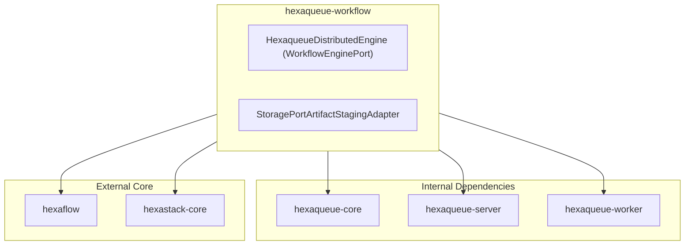

# ⏳ `hexaqueue-workflow`

> Distributed Cluster Engine & Artifact Staging for Hexaflow.

> Part of the [**Hexaqueue Scheduler**](https://dopplereffect.us/hexaqueue/) · Built on [**Hexastack**](https://dopplereffect.us/hexastack/) · Powered by [**Hexaflow**](https://dopplereffect.us/hexaflow/) · Governed by [**Hexaqual**](https://dopplereffect.us/hexaqual/).

---

## 🏗️ Architecture & Dependencies

