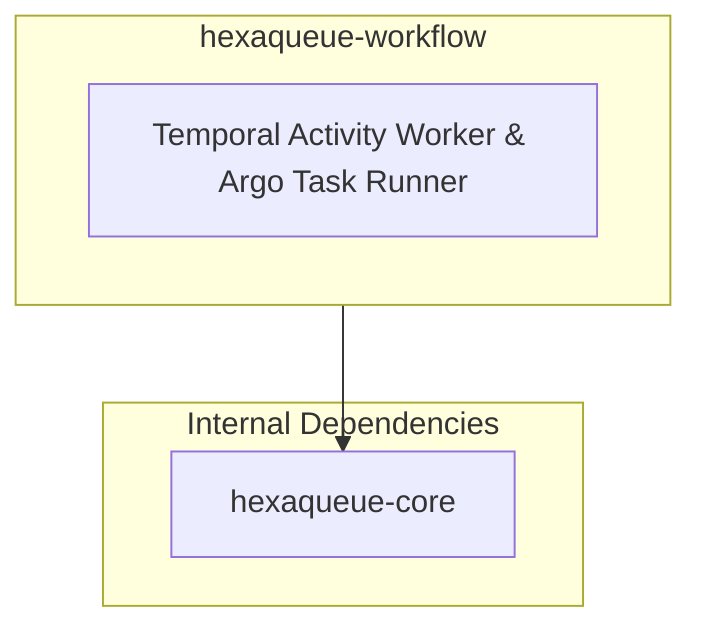

# ⏳ `hexaqueue-workflow`

> Temporal Activity Worker & Argo Workflow Task Driver.

---

## 🏗️ Architecture & Dependencies

```mermaid
graph TD
    subgraph S1["hexaqueue-workflow"]
        ACTIVITY["Temporal Activity Worker & Argo Task Runner"]
    end

    subgraph S2["Internal Dependencies"]
        HQ_CORE["hexaqueue-core"]
    end

    S1 --> HQ_CORE
```
