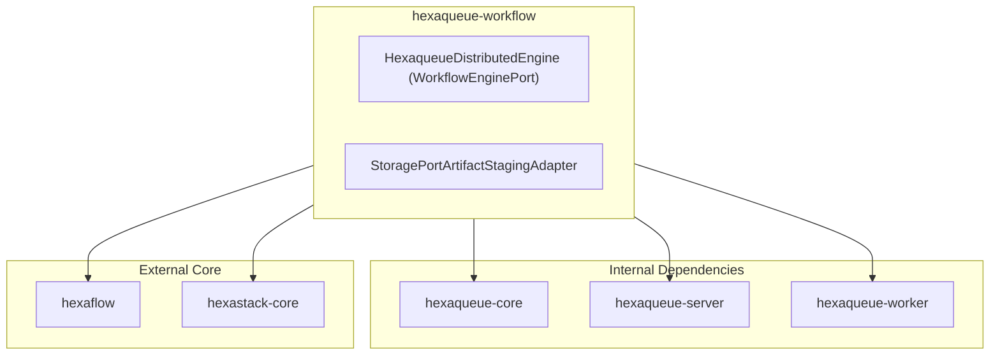

# ⏳ `hexaqueue-workflow`

> Distributed Cluster Engine & Artifact Staging for Hexaflow.

---

## 🏗️ Architecture & Dependencies

```mermaid
graph TD
    subgraph S1["hexaqueue-workflow"]
        ENGINE["HexaqueueDistributedEngine (WorkflowEnginePort)"]
        STAGING["StoragePortArtifactStagingAdapter"]
    end

    subgraph S2["Internal Dependencies"]
        HQ_CORE["hexaqueue-core"]
        HQ_SERVER["hexaqueue-server"]
        HQ_WORKER["hexaqueue-worker"]
    end

    subgraph S3["External Core"]
        HEXAFLOW["hexaflow"]
        HEXASTACK["hexastack-core"]
    end

    S1 --> HQ_CORE
    S1 --> HQ_SERVER
    S1 --> HQ_WORKER
    S1 --> HEXAFLOW
    S1 --> HEXASTACK
```
